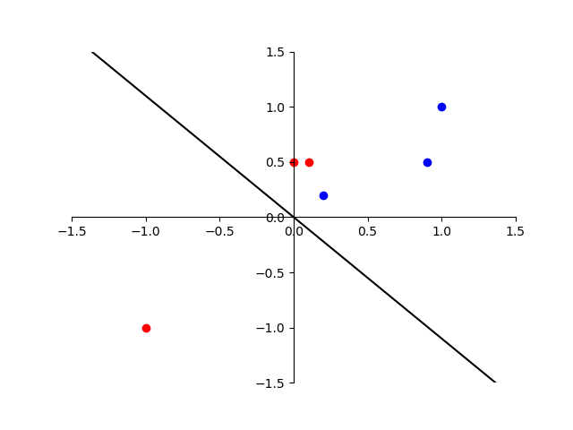

## Dependencies
* Pytorch 1.4
* Numpy
* Pandas

## Perceptron 

Training
`python train_perceptron.py --name perceptron --epochs 20`

* Main Arguments
	* `--name`: creates a directory inside the checkpoiints dir, where plots will be saved
	* `epochs`: No. of itertions
	* `batch_size`: No. of samples per batch

Results:

The perceptron converges at 15th epoch when initial weihgts are set at (1, 1)

## Neural Network

Training 
`python -m train_digit_recognizer.py --name digits --epochs 400 --train --numpy`

* Main Arguments
	* `--name`: creates a directory inside the checkpoiints dir, where plots will be saved
	* `epochs`: No. of itertions
	* `batch_size`: No. of samples per batch
	* `numpy`: make sure this flag is on, else the NN code will give error
	* `train`: if this flag is given then the network will be trained else ot performs prediction on the test set

## CNN

Training

`python train_chart_classifier.py --epochs 100 --name cnn --mode pytorch --csvfile train_val.csv  --pretrained  --train`

* Main Arguments
	* `--name`: creates a directory inside the checkpoiints dir, where plots will be saved
	* `epochs`: No. of itertions
	* `batch_size`: No. of samples per batch
	* `pretrained`: loads pretrained VGG model. If this flag is not given then a 2-layer CNN will be trained from scratch
	* `pytorch`: make sure this flag is on, else the CNN code will give error
	* `csvfile`: name of the csvfile
	* `dataroot`: path to charts charts datafolder
	* `imgdir`: name of the directory; either train-val or test
	* `checkpoints_dir`: path to the directory containing all checkpoints
